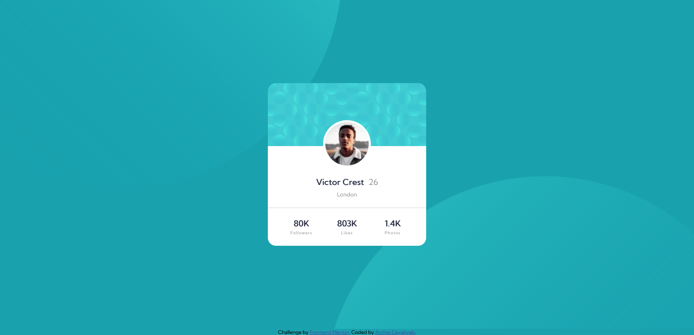
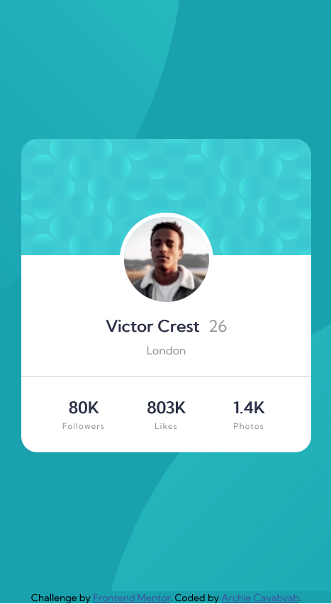

# Frontend Mentor - Profile card component solution

This is a solution to the [Profile card component challenge on Frontend Mentor](https://www.frontendmentor.io/challenges/profile-card-component-cfArpWshJ). Frontend Mentor challenges help you improve your coding skills by building realistic projects. 

## Table of contents

- [Overview](#overview)
  - [The challenge](#the-challenge)
  - [Screenshot](#screenshot)
  - [Links](#links)
- [My process](#my-process)
  - [Built with](#built-with)
  - [What I learned](#what-i-learned)
  - [Continued development](#continued-development)
  - [Useful resources](#useful-resources)
- [Author](#author)
- [Acknowledgments](#acknowledgments)

## Overview
- made a profile card component using a flexbox with media query

### The challenge

- Build out the project to the designs provided

### Screenshot

### Links

- Solution URL: [Add solution URL here](https://your-solution-url.com)
- Live Site URL: [Add live site URL here](https://your-live-site-url.com)

## My process
- wrote the html code
- design with css
- center the profile picture using position absolute
- used display flex on the socials 
- make a responsive (mobile first)

### Built with

- Semantic HTML5 markup
- CSS custom properties
- Position 
- Flexbox
- Mobile-first workflow

### What I learned

- I learned how to use the flexbox and position absolute to use the circle-shape as a background but still confused about media query and responsive design

### Continued development

- Responsice Design using media query
- different types of position

### Useful resources

- [Resource 1](https://youtu.be/MxEtxo_AaZ4) - This helped me for positioning the picture an absolute. I really liked this tutorial.

## Author

- Frontend Mentor - [@namdosanwannabe](https://www.frontendmentor.io/profile/namdosanwannabe)
- Twitter - [@_achikochi_](https://www.twitter.com/_achikochi_)

## Acknowledgments

- I'm really thankful to the people who makes a tutorial about web developement. Cheers!
